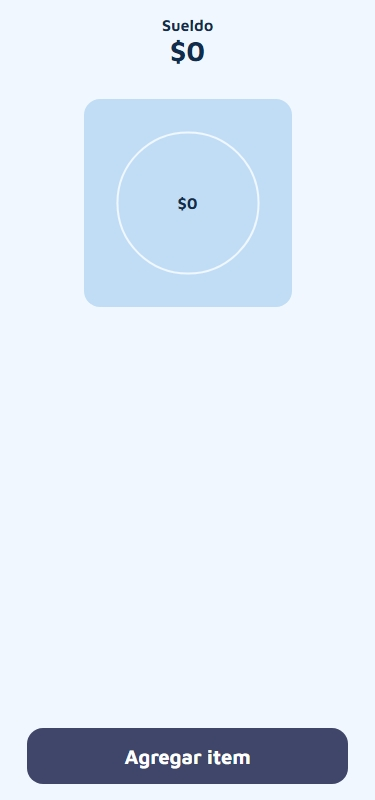
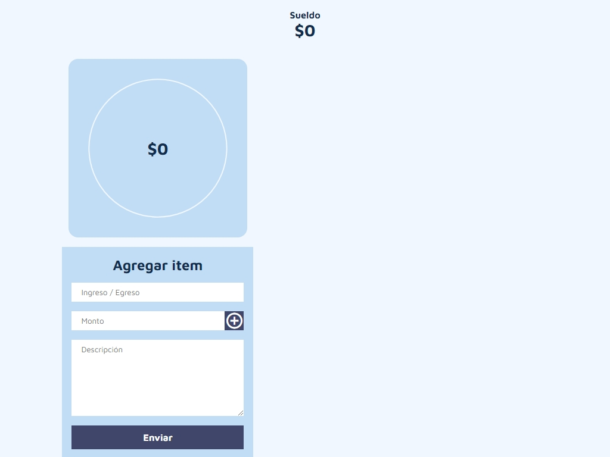

# Control de gastos

Control de gastos es una aplicación web que permite controlar gastos del usuario. Puedes agregar y eliminar ingresos y egresos para llevar el control

## Imágenes

## Link
[Ver el sitio web](https://arielnicolas2021.github.io/Control-de-gastos/)

## Tecnologías usadas

- HTML
- CSS
- Javascript

### Disponible para PC y celular!